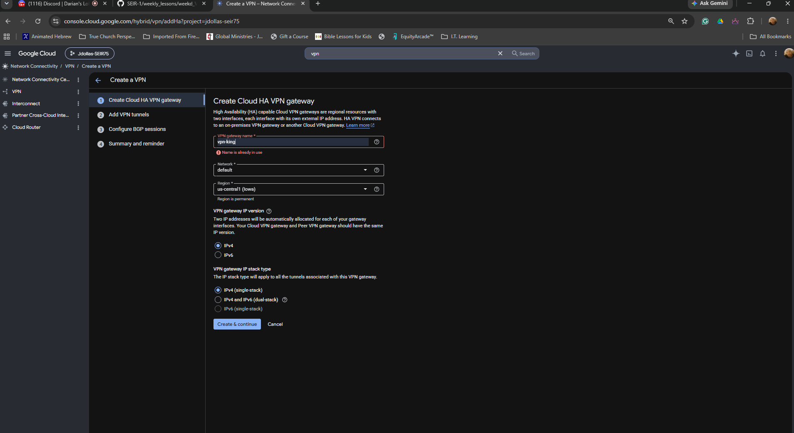
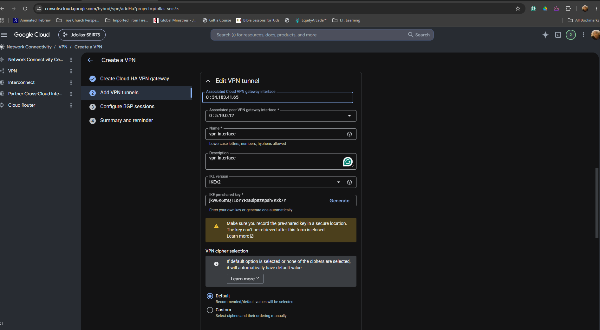
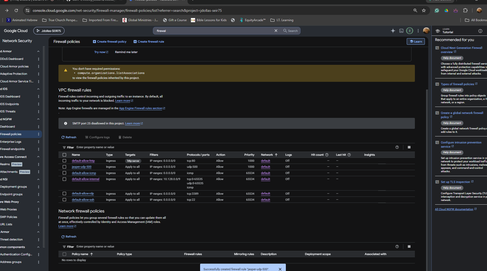
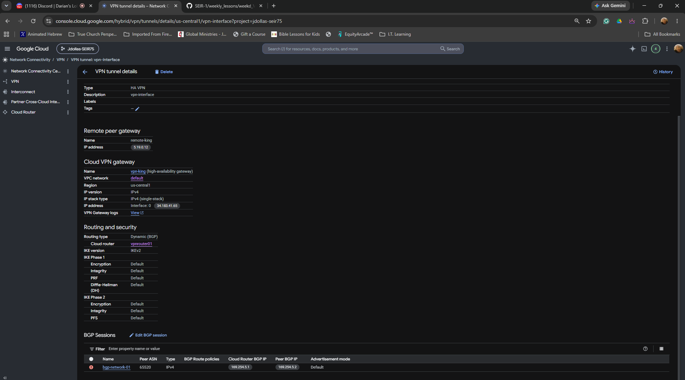
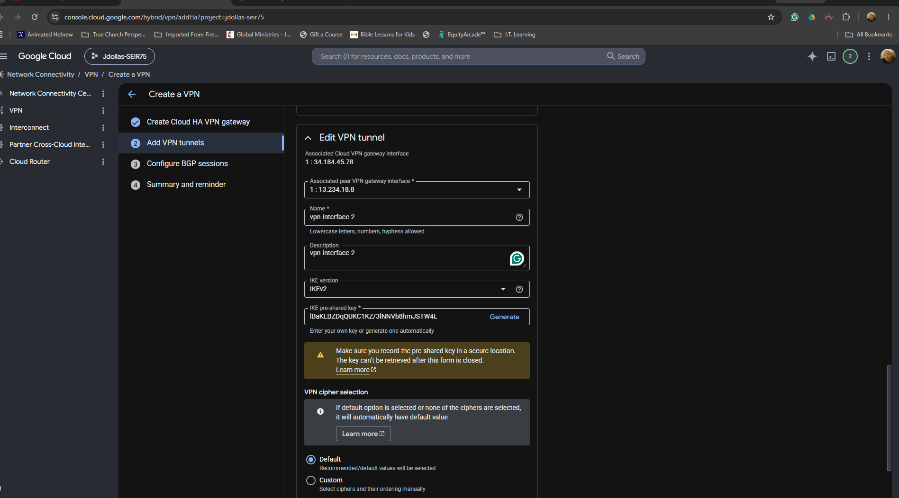
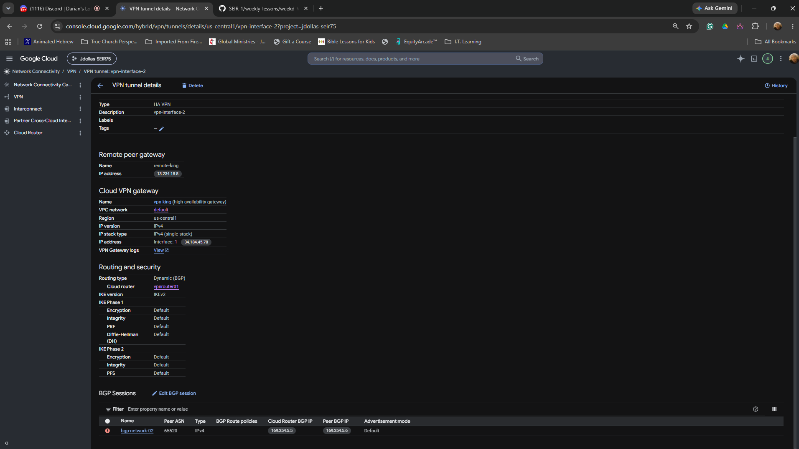
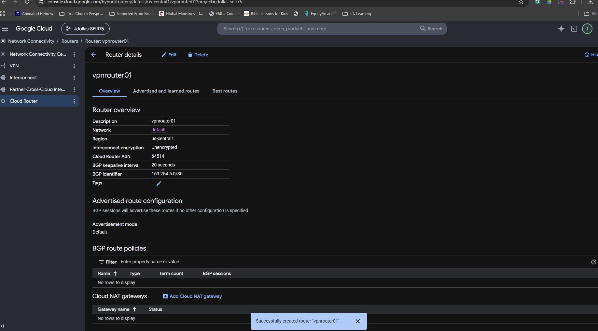
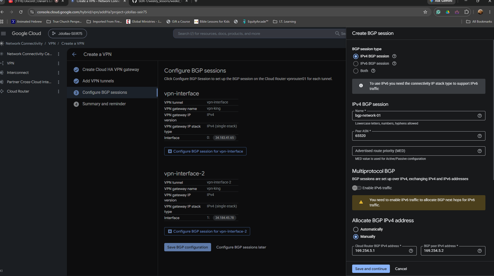
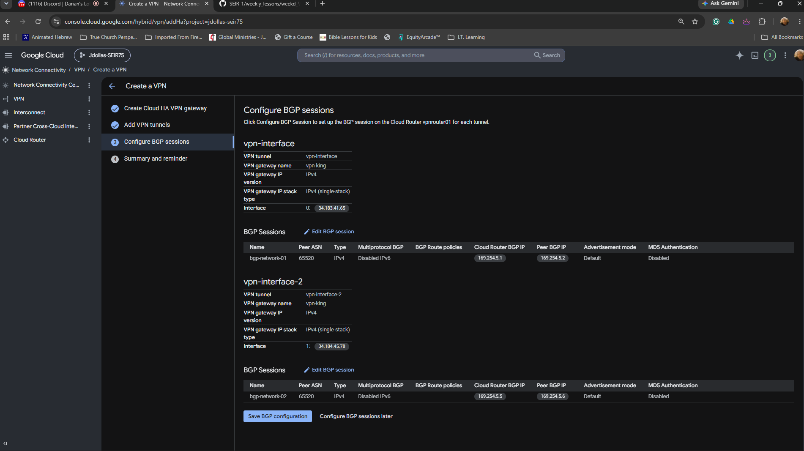

# IPSec VPN + BGP Assessment

## GCP HA VPN / Cloud Router / RFC Review

---

# 1

Question: According to RFC 4301, what is the primary purpose of IPSec?

A. To replace DNS servers
B. To secure IP communications through authentication and encryption (ANSWER)
C. To accelerate TCP throughput
D. To replace BGP routing

Please provide a screenshot of where IPSec VPN was configured in your GCP console.

---

# 2

Question: According to RFC 7296, which protocol version is used for modern IKE negotiation?

A. IKEv0
B. IKEv1
C. IKEv2 (ANSWER)
D. ESPv2

Please provide a screenshot showing where IKE version was configured in your VPN tunnel.

---

# 3

Question: Which UDP port is primarily used for IKE / ISAKMP negotiations?

A. UDP 179
B. UDP 500 (ANSWER)
C. UDP 443
D. UDP 3389

Please provide a screenshot of your firewall or VPN tunnel configuration showing UDP 500 usage.

---

# 4

Question: According to RFC 3948, which UDP port is commonly used for NAT Traversal (NAT-T)?

A. UDP 22
B. UDP 80
C. UDP 4500 (ANSWER)
D. UDP 161

Please provide a screenshot of your tunnel configuration showing NAT-T related settings or active tunnel status.

---

# 5

Question: What is the primary purpose of a Pre-Shared Key (PSK) in IPSec?

A. To assign BGP routes
B. To authenticate VPN peers (ANSWER)
C. To encrypt DNS traffic
D. To replace ESP encryption

Please provide a screenshot showing where the PSK was configured in your VPN tunnel setup.

---

# 6

Question: Which IPSec component is responsible for encrypting data traffic?

A. AH
B. ESP (ANSWER)
C. BGP
D. ICMP

Please provide a screenshot of your tunnel configuration showing ESP or encryption settings.

---

# 7

Question: What is the purpose of the Cloud Router in GCP?

A. Encrypt traffic
B. Replace the VPN Gateway
C. Exchange BGP routing information (ANSWER)
D. Perform DNS resolution

Please provide a screenshot of your Cloud Router configuration.

---

# 8

Question: Which RFC defines the Encapsulating Security Payload (ESP)?

A. RFC 4303 (ANSWER)
B. RFC 4271
C. RFC 1918
D. RFC 1035

Please provide a screenshot showing IPSec tunnel encryption settings.

---

# 9

Question: Which protocol and port are used by BGP?

A. UDP 500
B. TCP 179 (ANSWER)
C. TCP 443
D. UDP 161

Please provide a screenshot showing your BGP session configuration.

---

# 10

Question: What is the purpose of the 169.254.x.x addresses used in HA VPN BGP sessions?

A. Public Internet routing
B. DNS failover
C. Link-local BGP peer communication (ANSWER)
D. DHCP assignment

Please provide a screenshot showing your BGP peer IP addresses.

---

# 11

Question: According to RFC 4271, what is the purpose of BGP?

A. Encrypt VPN traffic
B. Dynamically exchange routing information!!!!!!!!!!!!!!!!!!!!!!!!!!!!!!!
C. Replace TCP
D. Manage DNS records

Please provide a screenshot showing learned or advertised BGP routes.

---

# 12

Question: What is the most common cause of Phase 1 IPSec failures?

A. MTU mismatch
B. Incorrect VM subnet
C. PSK mismatch (ANSWER)
D. DNS timeout

Please provide a screenshot showing your VPN tunnel status page.

---

# 13

Question: Which of the following is typically configured on both VPN peers?

A. Different PSKs (ANSWER)
B. Different BGP peer IPs on same side
C. Matching encryption settings
D. Random ASN values

Please provide a screenshot showing your Phase 1 or tunnel cryptographic configuration.

---

# 14

Question: Which GCP component creates the public IP addresses used by the VPN tunnels?

A. Cloud DNS
B. HA VPN Gateway (ANSWER)
C. Cloud NAT
D. VPC Firewall

Please provide a screenshot showing the external IPs assigned to your HA VPN Gateway.

---

# 15

Question: What BGP session state indicates successful route exchange?

A. Idle
B. Connect
C. Active
D. Established (ANSWER)

Please provide a screenshot showing your BGP session state.

---

# 16

Question: Which IPSec protocol uses IP Protocol 50?

A. AH
B. ESP (ANSWER)
C. BGP
D. NAT-T

Please provide a screenshot or CLI output showing active IPSec traffic or tunnel details.

---

# 17

Question: Why do companies commonly deploy dual HA VPN tunnels?

A. To increase DNS speed
B. For redundancy and failover (ANSWER)
C. To eliminate BGP
D. To disable encryption

Please provide a screenshot showing both VPN tunnels configured in GCP.

---

# 18

Question: What is the primary purpose of NAT Traversal (NAT-T)?

A. Compress VPN traffic
B. Encrypt DNS queries
C. Allow IPSec traffic through NAT devices (ANSWER)
D. Replace ESP headers

Please provide a screenshot showing tunnel configuration or firewall rules related to NAT-T.

---

# 19

Question: Which of the following best describes a Security Association (SA)?

A. A DNS forwarding table
B. A set of agreed IPSec security parameters (ANSWER)
C. A static route table
D. A load balancer policy

Please provide a screenshot showing your VPN tunnel parameters or IPSec settings.

---

# 20

Question: What is the correct order of IPSec and BGP establishment?

A. BGP → IPSec → IKE
B. IKE Phase 1 → IPSec Phase 2 → BGP (ANSWER)
C. NAT-T → DNS → ESP
D. Firewall → DNS → BGP

Please provide a screenshot showing both tunnel establishment and BGP peer status in your console.

---

